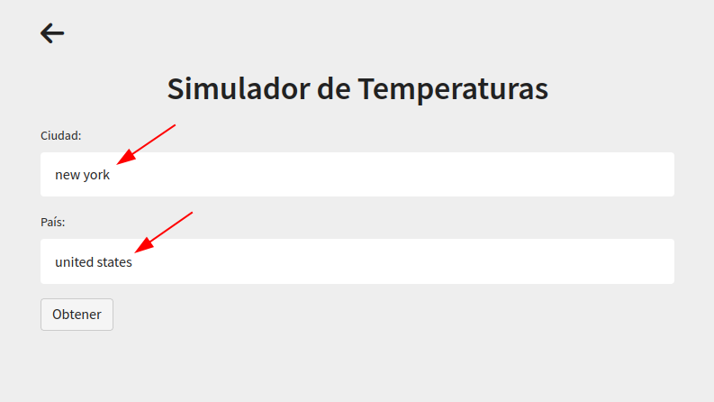

# Temperature Analysis Application

Get Time Series Analysis from a simple Streamlit app

## Requirements

The program was written using a Python 3.9 environment, and the following libraries:

- [Pandas](http://pandas.pydata.org/)
- [Selenium](https://www.selenium.dev/)
- [Seaborn](https://seaborn.pydata.org/)
- [StatsModels](https://www.statsmodels.org/stable/index.html)
- [Scikit-Learn](https://scikit-learn.org/)
- [Psycopg2](https://pypi.org/project/psycopg2/)
- [Streamlit](https://streamlit.io/)
- [Plotly](https://plotly.com/)
- [NCEI API Service](https://www.ncei.noaa.gov/support/access-data-service-api-user-documentation)


## How to install
### Database

The dataset is stored in a PostgreSQL database. Download it from the following
[link](https://www.postgresql.org/download/), and create a database named "climatedb".

###Application
On terminal, run:
```
pip install -r requirements.txt
```
to install the requirements. Then run
```
python psql_create_tables.py
```
to create all tables.
Finally run
```
streamlit run temperature_app.py 
```


## How to use.

Write the name of any city, and its country.

For example:



And then, if (city, country) exists on the database, you will get the analysis. For example:


## How does it work?

Once the user enters the city and the country, the application verifies inside a PSQL 
Database if the combination exists. If it exists, the algorithm continues with the analysis 
written in `temperature_app.py`.

If not, the application searchs into `worldcities.csv` dataset for the exact coordinates of the 
city, country. After finding them, it opens the 
[NCEI](https://www.ncei.noaa.gov/access/search/data-search/daily-summaries) 
wepage in a browser to search any station code in order to download a temperature dataset and 
insert it into the PSQL Database. And eventually be able to continue with the `temperature_app.
py` algorithm.

Any dataset can be downloaded manually running on terminal
```
get_daily_summaries.py
```

## Support

Give a :star: if you like it :hugs:.